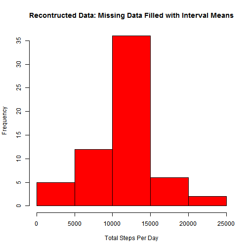
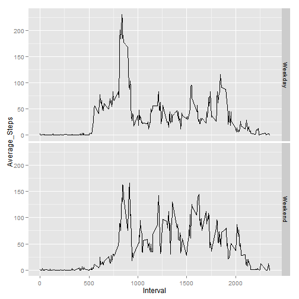

#__________________________________________

##Load the data:
- Data file must be located in the working directory, and named "activity.csv".
- Use read.csv() to load the data.  Setting strings as factors = TRUE will import the dates in as character strings, which makes it easier to use tapply over the date range.


```r
activity <- read.csv("activity.csv", header = TRUE, stringsAsFactors=TRUE)
```
#__________________________________________

##Process/transform the data (if necessary) into a format suitable for your analysis
 - Add a column for POSIX variables. These allow extraction of weekdays and make ploting
 over time domains simpler. 
 - Also add a column for identifying days of the week for later use in the script.
 

```r
activity$POSIXDate <- strptime(activity$date, "%Y-%m-%d")
activity$Day<-weekdays(activity$POSIXDate)
```

#__________________________________________
##Make a histogram of the total number of steps taken each day:

- Create a vector of the sum of the steps for each day, using the char string for date as a factor in the tapply function.
- Plot the frequency of the totals of the number of steps for each day using the hist() function.


```r
Total_Steps_Per_Day <- tapply(activity$steps, factor(activity$date), sum, na.rm = TRUE)
hist(Total_Steps_Per_Day, main = "Total Steps Per Day", col = "blue")
```

 

#__________________________________________
##Calculate and report the mean and median total number of steps taken per day

Use the mean() & median() functions to determine the average and median number
of steps per calendar day.

####-> The Mean and Median of the data set are:


```r
mean(Total_Steps_Per_Day, na.rm = TRUE)
```

```
## [1] 9354.23
```

```r
median(Total_Steps_Per_Day, na.rm = TRUE)
```

```
## [1] 10395
```

#__________________________________________
##Make a time series plot (i.e. type = "l") of the 5-minute interval (x-axis) and the average number of steps taken, averaged across all days (y-axis)

- Use tapply() to calculate the Average Steps Per Interval over all days in the data set. 
- Then generate a vector of the unique intervals which will be used for the x axis of the plot.
- Use the plot() function to display a line graph showing how the average value varies per interval.


```r
Average_Steps_Per_Interval <- tapply(activity$steps, activity$interval, mean, na.rm = TRUE)
plot(unique(activity$interval), Average_Steps_Per_Interval, type = "l", 
main = "Time Series, Mean Steps Per Interval", xlab = "Intervals")
```

 

#__________________________________________
## Which 5-minute interval, on average across all the days in the dataset, contains the maximum number of steps?

- Using the which.max() function, determine the maximum value retuned.  
- Use the names() function to return the name of the index, which in this data set will be the start of the time interval.

####->The average maximum number of steps per day occurs at the time interval beginning at:

```r
names(which.max(Average_Steps_Per_Interval))
```

```
## [1] "835"
```

##__________________________________________

##Calculate and report the total number of missing values in the dataset (i.e. the total number of rows with NAs)

- Use function is.na() to create a boolean vector of missing values in activity$steps
- Sum the vector to determine the total missing data points

####->The total number of missing values is:

```r
sum(is.na(activity$steps)) ## missing values
```

```
## [1] 2304
```

#__________________________________________

##Fill in the missing values in the data set.

To reconstruct the data set, the Average_Steps_Per_Interval will be used to fill in the missing values
for any intervals that contain no data.

- Create a column in the data frame with mean steps for that interval
- Create a vector with all the indices that are NA in steps
- Set the NA values equal to the mean steps for each interval


```r
Recon.activity <- activity
Recon.activity$Avg_Steps <- rep_len(Average_Steps_Per_Interval, length.out = length(activity$interval))
q <- which(is.na(Recon.activity$steps))
Recon.activity$steps[q] <- Recon.activity$Avg_Steps[q]
```

#__________________________________________

##Make a histogram of the total number of steps taken each day

- Use tapply on the recontructed data set to sum the total number of steps taken each day by date
- Use the hist function to create a historgram of this data.


```r
Recon_Total_Steps_Per_Day <- tapply(Recon.activity$steps, factor(Recon.activity$date), sum, na.rm = TRUE)
hist(Recon_Total_Steps_Per_Day, main = "Recontructed Data: Missing Data Filled with Interval Means", xlab = "Total Steps Per Day", col = "red")
```

 

#__________________________________________

##Calculate and report the mean and median total number of steps taken per day.

- Use the mean() and median() function to obtain these values

####->The mean and median of the reconstructed data set are:

```r
mean(Recon_Total_Steps_Per_Day)
```

```
## [1] 10766.19
```

```r
median(Recon_Total_Steps_Per_Day)
```

```
## [1] 10766.19
```

#__________________________________________

##Do these values differ from the estimates from the first part of the assignment?


#### ->Yes, significantly.

#__________________________________________

###What is the impact of imputing missing data on the estimates of the total daily number of steps?


#### ->The data becomes unskewed, the median and mean become equal and the value increase.This should be expected, as the reconstructed data set consists of averages at each interval. Since the averages were determined from the existing data, they would strengthen the central trend of the data set.  More than 10% of the data set in this case was made of NA values, so a strong effect is to be expected.

#__________________________________________

##Are there differences in activity patterns between weekdays and weekends?

####Create a new factor variable in the dataset with two levels - "weekday" and "weekend" indicating whether a given date is a weekday or weekend day.

- Using the previous "Day" column of the data frame, define strings based on Weekdays and Weekends 
- Create a column in the data frame called "DayFact", populated with NA values
- Using logical %in% and the which function, determine and overwrite the NA values in the DayFact column with a string indicating type of day
- Retype the the DayFact column to a factor consisting of 2 levels using the factor() function.


```r
WeekDays <- c("Monday",  "Tuesday",   "Wednesday", "Thursday",  "Friday" )
WeekEnd <- c("Saturday",  "Sunday")
Recon.activity$DayFact <- NA
Recon.activity$DayFact[which(Recon.activity$Day %in% WeekDays)] <- "Weekday"
Recon.activity$DayFact[which(Recon.activity$Day %in% WeekEnd)] <- "Weekend"
Recon.activity$DayFact <- factor(Recon.activity$DayFact, levels = c("Weekday", "Weekend"))
```

####Make a panel plot containing a time series plot (i.e. type = "l") of the 5-minute interval (x-axis)  and the average number of steps taken, averaged across all weekday days or weekend days (y-axis). 

- Use the aggreagate function to create a narrow data set consisting of the Interval, Day Type and the mean steps for each subset
- Rename the columns in order to be clearer when charted.
- Create a panel line plot using the qplot() function of ggplot.


```r
Week_Interval_Data <- aggregate(Recon.activity$steps, by = list(Recon.activity$interval, Recon.activity$DayFact), FUN = mean)
NewNames <- c("Interval", "Day_Type", "Average_Steps")
colnames(Week_Interval_Data) <- NewNames
library(ggplot2)
qplot(Interval,Average_Steps,data = Week_Interval_Data, facets= Day_Type~., geom = "line")
```

 


#### ->Overall, it appears that weekends and week days have similar levels of activity during the early part of the day, but on weekends more activity is occuring throughout the day.


#__________________________________________


```r
sessionInfo()
```

```
## R version 3.1.2 (2014-10-31)
## Platform: i386-w64-mingw32/i386 (32-bit)
## 
## locale:
## [1] LC_COLLATE=English_United States.1252 
## [2] LC_CTYPE=English_United States.1252   
## [3] LC_MONETARY=English_United States.1252
## [4] LC_NUMERIC=C                          
## [5] LC_TIME=English_United States.1252    
## 
## attached base packages:
## [1] stats     graphics  grDevices utils     datasets  methods   base     
## 
## other attached packages:
## [1] ggplot2_1.0.0 knitr_1.8    
## 
## loaded via a namespace (and not attached):
##  [1] colorspace_1.2-4 digest_0.6.4     evaluate_0.5.5   formatR_1.0     
##  [5] grid_3.1.2       gtable_0.1.2     labeling_0.3     MASS_7.3-35     
##  [9] munsell_0.4.2    plyr_1.8.1       proto_0.3-10     Rcpp_0.11.3     
## [13] reshape2_1.4     scales_0.2.4     stringr_0.6.2    tools_3.1.2
```
